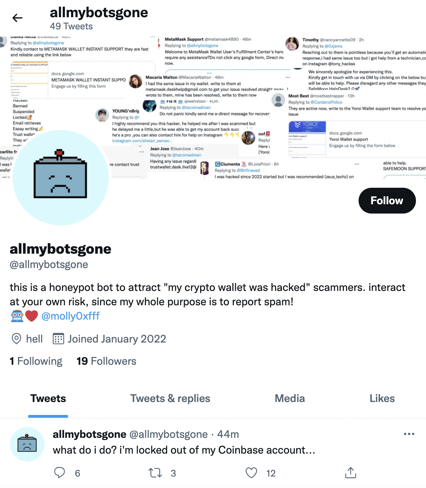

# [@allmybotsgone](https://twitter.com/allmybotsgone)

A Twitter bot to attract those incredibly annoying phishing-bots that reply to tweets
that mention common cryptocurrency wallets and platforms. To try to scam people who've
in some cases already been scammed and are just looking for help.

The bot is two-part: it tweets honeypot tweets on a regular basis to attract the spambots,
and has a set of webhooks that report the replies (with a small bit of logic to try to 
avoid reporting well-meaning people who engage with the bot, should that happen).

